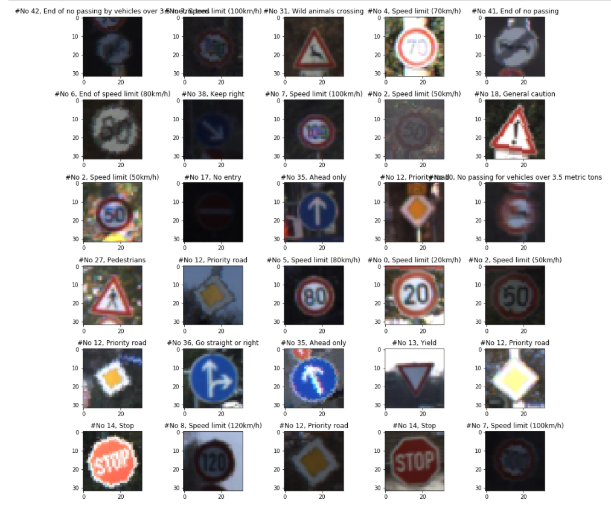

## Project: Build a Traffic Sign Recognition Program
[](http://www.udacity.com/drive)

This project is an implementation of Deep Neural Networks and Image processing to Classify the Traffic Signs in the [German Traffic Sign Dataset](http://benchmark.ini.rub.de/?section=gtsrb&subsection=dataset).

### Dependencies

- Python 3.5
- [TensorFlow 1.4](http://tensorflow.org)
- [Jupyter](http://jupyter.org/)
- [NumPy](http://www.numpy.org/)
- [SciPy](https://www.scipy.org/)
- [Matplotlib](http://matplotlib.org/)
- Open CV2

### Dataset

1. [Download the dataset](https://d17h27t6h515a5.cloudfront.net/topher/2016/November/581faac4_traffic-signs-data/traffic-signs-data.zip). 
2. This is a pickled dataset which has already resized the images to 32x32.


### Steps

1. Clone the project and start the notebook.
```
git clone https://github.com/Mohit-Ak/CarND-Traffic-Sign-Classifier.git
cd CarND-Traffic-Sign-Classifier
jupyter notebook Traffic_Sign_Classifier.ipynb
```
2. Follow the instructions in the `Traffic_Signs_Recognition.ipynb` notebook.

### FINAL ACCURACY
| Dataset        	|     Accuracy        					| 
|:---------------------:|:---------------------------------------------:| 
| Validation         			| 94.2%   									| 
| Test    				|92.7% 										|

### AUTHOR
 [Mohit Arvind Khakharia](http://mohit.pro)
